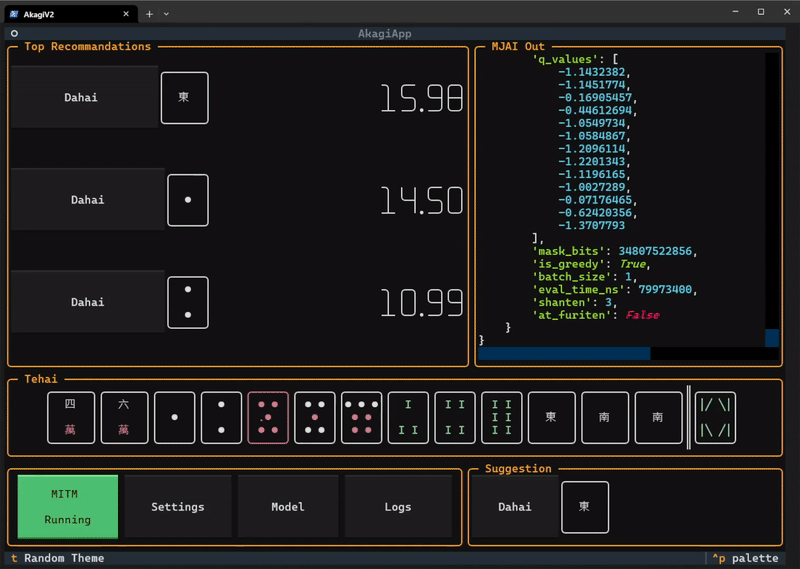
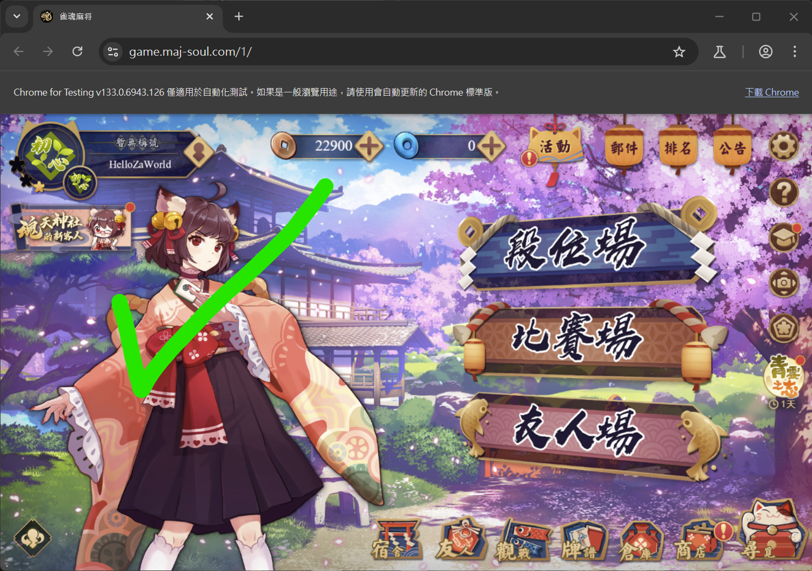
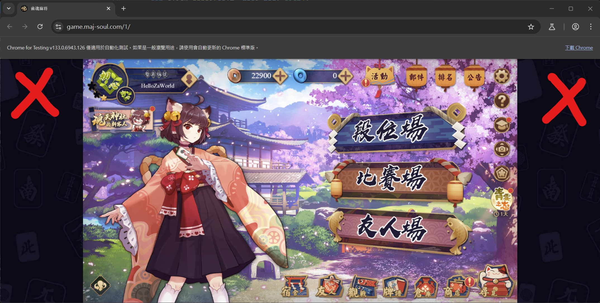
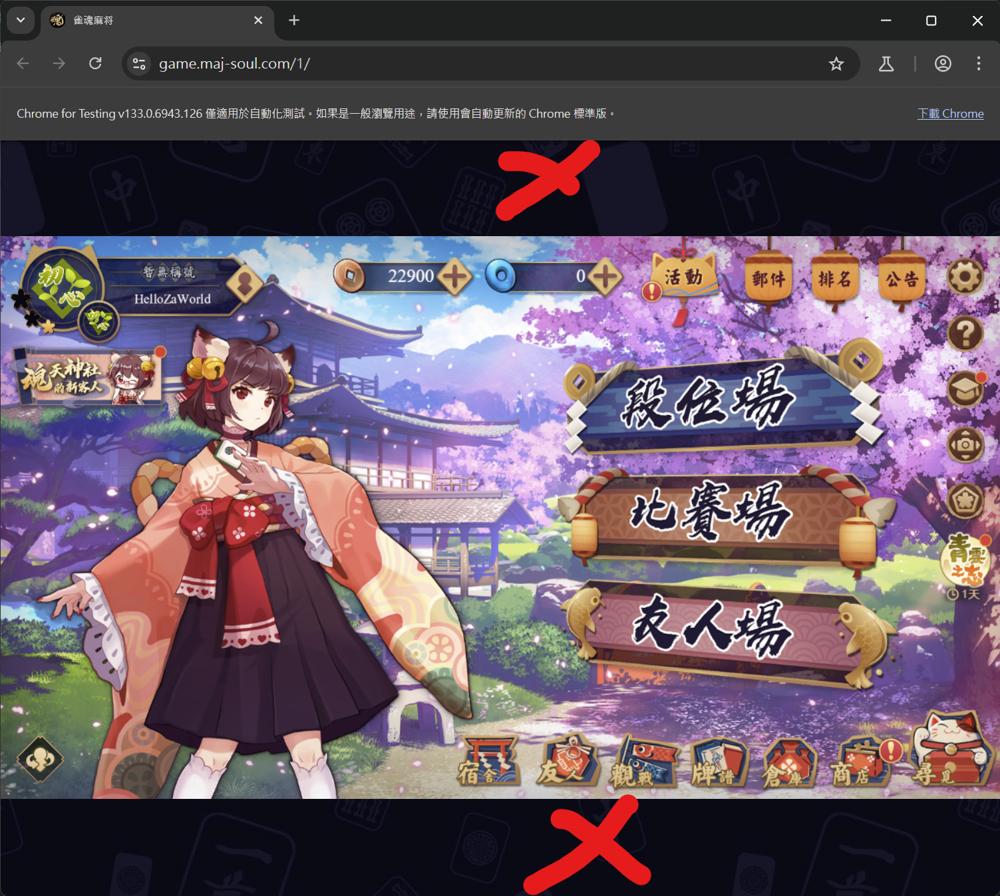

<br/>
<p align="center">
  
  <h1 align="center">Akagi</h3>

  <p align="center">
「死ねば助かるのに………」- 赤木しげる<br>
<br>
    <br/>
    <br/>
    <a href="https://discord.gg/Z2wjXUK8bN">Ask me anything about this at Discord</a>
    <br/>
    <br/>
    <a href="./README_ZH.md">中文</a>
    <br/>
    <a href="https://github.com/shinkuan/Akagi/issues">Report Bug</a>
    .
    <a href="https://github.com/shinkuan/Akagi/issues">Request Feature</a>
  </p>
</p>

<p align="center">
  <a href="https://github.com/shinkuan/Akagi"></a>
  <a href="https://github.com/shinkuan/Akagi/releases"></a>
  <a href="https://github.com/shinkuan/Akagi/issues"></a>
  <a href="https://github.com/shinkuan/Akagi"></a>
  <a href="https://discord.gg/Z2wjXUK8bN"></a>
  <a href="https://deepwiki.com/shinkuan/Akagi"></a>
</p>

# Playwright

This branch leverages **Playwright** to provide a robust and streamlined automation experience. A key advantage of this implementation is the elimination of complex proxy configurations; you **no longer need to set up tools like mitmproxy or Proxifier**. Furthermore, this branch features **built-in autoplay** functionality, **allowing automated tasks to run seamlessly in the background**.

TL;DR
- **No need for mitmproxy or Proxifier**.
- **Built-in autoplay**.
- **Can run in the background**.

# About

## "The purpose of this project is to provide people with a convenient way to real-time understand their performance in Mahjong game matches and to learn and improve from it. This project is intended for educational purposes only, and the author is not responsible for any actions taken by users using this project. Game developers and publishers have the right to take action against users who violate their terms of service, any consequences such as account suspension are not related to the author."


# Feature
- Real-time analysis of your game.
- Support for multiple platforms.
  - Majsoul
  - Tenhou
  - RiichiCity
  - Amatsuki
- Support for multiple game modes.
  - Four Player
  - Three Player
- Support for multiple AI models.
  - Builtin model
  - Online server model
  - Your own model
- AutoPlay
  - *Only available on Windows Release version when ot_server is running.
- TUI
  - Using Textual UI.
  - Support for multiple themes.

# Table of Contents

### ⚠️ READ THE DOC BEFORE YOU START
### ⚠️ READ THE DOC BEFORE YOU START
### ⚠️ READ THE DOC BEFORE YOU START

- [About](#about)
- [Before You Start](#before-you-start)
- [Installation](#installation)
- [Usage](#usage)
- [Troubleshooting](#troubleshooting)
- [Developer](#developer)
- [LICENSE](#license)
  
# Before You Start

> [!WARNING]  
> This branch does not require any proxy tools like mitmproxy or Proxifier.
> Video below is for the main branch, which requires mitmproxy and Proxifier.

🎥[YouTube Video for you to follow.](https://youtu.be/Z88Ncxbe2nw)

### You will need:

1. A `mjai_bot`. 
   1. A working one is already included [here](./mjai_bot/mortal).
      - Because the limit of the file size, the `mortal.pth` here is a tiny weak small model.
      - It is not recommended to use it in a real game.
      - You can get a better model from [Discord](https://discord.gg/Z2wjXUK8bN).
      - Or use the hosted model from the online server.
      - You can get the API key from [Discord](https://discord.gg/Z2wjXUK8bN).
   2. Or make your own one, check [Developer setcion](#developer).
2. Use Windows Terminal to open akagi for a nice looking TUI.

> [!WARNING]  
> __Windows Terminal__ is required for user interface to work properly.
> Defalt Windows console will make the UI look ugly and not usable.

### Supported Mahjong Games:

**This branch only supports Majsoul.**
**For other games, please use the main branch.**

| Platform       | Four Player   | Three Player   | AutoPlay |
| -------------- | ------------- | -------------- | -------- |
| __Majsoul__    | &check;       | &check;        |  &check; |
| __Tenhou__     | &cross;       | &cross;        |  &cross; |
| __RiichiCity__ | &cross;       | &cross;        |  &cross; |
| __Amatsuki__   | &cross;       | &cross;        |  &cross; |


# Installation

- For User:
  - Go to [release page](https://github.com/shinkuan/Akagi/releases)
  - Download the latest release of the Playwright version.
  - Extract the zip file.
  - (Optional) Put MJAI bots in `./Akagi/mjai_bot`.
  - Run `run_akagi.exe`
  - (Optional) Setup your API Key in the settings for Online Model.
- For Developer:
  - Clone the repository.
  - Use Python 3.12
  - Install the dependencies using `pip install -r requirements.txt`.
  - Install Playwright browsers using `python -m playwright install`.
  - Put MJAI bots in `./Akagi/mjai_bot`.
    - For the builtin model, move `./mjai_bot/mortal/libriichi/libriichi-<version>-<platform>.<extension>` to `./mjai_bot/mortal/libriichi.<extension>`.
    - Same for 3p model.
  - Run `run_akagi.py`.

# Usage

1. **Check your settings and AI Model.**
   1. Select a Model.
      - By clicking on the "Model" button in the bottom left corner.
      - Select a model from the list.
      - If you don't have a model, get it from [Discord](https://discord.gg/Z2wjXUK8bN).
      - Builtin default model is weak AI.
      - __Choose 3P model for 3P game!__
      - __Do not join 3P game with 4P model!__
   2. Check your settings.
      - By clicking on the "Settings" button in the bottom left corner.
      - Check your settings and make sure they are correct.
      - If you have got a Online server API key, set it in the settings.
      - Online server provides a stronger AI model.
      - You can get the API key from [Discord](https://discord.gg/Z2wjXUK8bN).
   3. Save your settings.
      - By clicking on the "Save" button.
      - This will save your settings.
   4. Restart Akagi.
      - Close Akagi and open it again.
      - This will apply the settings.
4. **Start the game client.**
   - You can change the game client URL in the settings.
   - Launch the game client (e.g., Mahjong Soul) and log in.
5. **Join a game.**
   - Join a game as you normally would.
6. **Check Akagi.**
   - You should see the AI analyzing the game in real-time.
   - If you see any errors, check the Logs for more information.
   - Or ask for help in the [Discord](https://discord.gg/Z2wjXUK8bN) server.

## Instructions

### Akagi

#### Starting MITM Proxy Server:
> [!IMPORTANT]
> The MITM text here is for the main branch, you will see Playwright instead.


#### Selecting AI Model:
Models are stored in `./mjai_bot/` folder.


#### Changing Settings:
> [!IMPORTANT]  
> Restart might be required to apply the settings.


#### Opening Logs:
When you encounter a problem, you can open the logs to see what happened.
Report the issue with the logs.

logs are saved in `./logs/` folder.


#### Changing MJAI Info Window:
Click on the MJAI Info window to change kind of info you want to see.


#### AutoPlay:
Make sure you have set the display of the game client to 16:9 aspect ratio.




#### Changing theme:


#### Call Reach
The recommandation window does not show which tile to discard for riichi?
You have to click on the "Reach" button to show the call reach recommendation.


# Troubleshooting

You can ask for help in the [Discord](https://discord.gg/Z2wjXUK8bN) server.

> [!TIP]
> If you encounter any issues, please check the logs in `./logs/` folder.
> The logs are saved in the `./logs/` folder.
> You can also check the GitHub Issues

> [!NOTE]
> If you find a bug, please report it in the GitHub Issues.
> You can also report it in the Discord server.
> If you have a feature request, please report it in the GitHub Issues.

# Developer

## File Structure

- `./Akagi/` - The main folder of the project.
  - `akagi/` - Contains the Textual UI for Akagi.
  - `logs/` - Contains the logs of the game.
  - `playwright_client/` - Contains the Playwright logics.
    - `bridge/` - Contains the bridge between the game client and the server. This is for converting the game client protocol to MJAI protocol. You can make your own bridge here.
      - `majsoul/` - Contains the bridge for Majsoul.
  - `mjai_bot/` - Contains the MJAI bots.
    - `base/` - Base class for MJAI bots. Check it out if you want to make your own bot.
    - `*/` - MJAI bots. This is your mjai_bot. For example, `mortal/`.
  - `settings/` - Contains the settings of the project.
  - `run_akagi.py` - The main file to run the project.

## Bridge

> [!WARNING] 
> I don't recommend you to make your own bridge on this branch.
> This branch is designed to work with Majsoul only.
> If you want to make your own bridge, please use the main branch.

## MJAI Bot

To make a MJAI bot, you need to implement the `Bot` class in `mjai_bot/base/bot.py`.

TODO: make an tsumogiri bot example.

## TODO

- [x] Three Player Mahjong support.
- [x] RiichiCity support.
- [x] Show which tile to discard after call for riichi.
- [ ] Show which tile to Kan after call for Kan (rare case).

# Contact

- [Shinkuan](https://github.com/shinkuan/) - shinkuan318@gmail.com
- [Discord](https://discord.gg/Z2wjXUK8bN)

# LICENSE

```
“Commons Clause” License Condition v1.0

The Software is provided to you by the Licensor under the License, as defined below, subject to the following condition.

Without limiting other conditions in the License, the grant of rights under the License will not include, and the License does not grant to you, the right to Sell the Software.

For purposes of the foregoing, “Sell” means practicing any or all of the rights granted to you under the License to provide to third parties, for a fee or other consideration (including without limitation fees for hosting or consulting/ support services related to the Software), a product or service whose value derives, entirely or substantially, from the functionality of the Software. Any license notice or attribution required by the License must also include this Commons Clause License Condition notice.

Software: Akagi

License: GNU Affero General Public License version 3 with Commons Clause

Licensor: shinkuan
```
